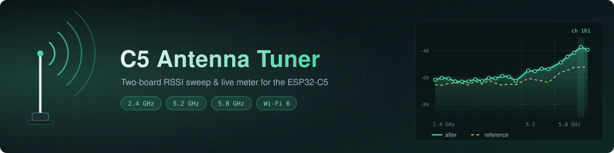

<p align="center">
  
</p>

# C5 Antenna Tuner

A two-board antenna tuning aid for the **ESP32-C5**, covering 2.4 GHz and 5 GHz (including the 5.8 GHz band, channels 149-165).

One C5 transmits probe packets. A second C5, with the antenna under test attached, measures the received signal strength and streams it over USB to a browser viewer. You change the antenna, watch the number move, and keep what works better.

> **This is a relative RSSI meter, not a VNA.** It tells you whether a change to an antenna (trimming, repositioning, a new ground plane) made the link better or worse. It cannot measure impedance, SWR or return loss. See [Limitations](#limitations).

## Features

- **Sweep mode:** hops across 22 channels (2.4 GHz ch 1-13, 5.2 GHz ch 36-48, 5.8 GHz ch 149-165) and plots RSSI per channel.
- **Lock mode:** parks on one channel (for example 161 = 5805 MHz) for a fast live readout while you adjust by hand.
- **Reference comparison:** save a sweep as a baseline, change the antenna, and overlay the new sweep.
- **TX control from the PC:** set the channel, bandwidth (20 or 40 MHz), power and sweep dwell over serial or from the viewer.
- **No install for the viewer:** a single HTML file using the Web Serial API (Chrome or Edge).
- **Self-syncing meter:** follows the transmitter's channel hops and re-acquires it automatically if the link is lost.

## How it works

```
 +-----------+   ESP-NOW broadcast probes   +------------+   USB serial   +------------+
 |  TX  C5   | ---------------------------> |  METER C5  | -------------> | viewer.html|
 | hops/locks|   (channel + hop timing      | antenna    |  S,ch,MHz,...  |  (browser) |
 +-----------+    carried in each packet)   | under test |                +------------+
       ^  USB serial commands (CH, BW, POWER...)
       +--------------------------------------------------- viewer / terminal
```

Each probe carries the TX's current channel, mode and time until its next hop, so the meter can follow without a separate sync channel. The meter averages RSSI per dwell and prints one CSV line per channel.

## Hardware

- 2x ESP32-C5 boards (for example Seeed XIAO ESP32-C5 or an Espressif C5 DevKit)
- USB cables (the meter must connect to the PC; the TX needs power, and a PC connection if you want to control it)
- The antenna you want to test, on the meter

## Requirements

- **ESP-IDF 5.5 or newer** (the ESP32-C5 is not supported by older releases)
- Chrome or Edge for the viewer (Web Serial is not available in Firefox)

## Build and flash

The role (TX or METER) is chosen at build time. `sdkconfig.tx` and `sdkconfig.meter` select it, so you can build both without menuconfig. Replace the ports with your own (`COMx` on Windows, `/dev/ttyACM0` on Linux).

```
# TX board
idf.py -B build-tx -DIDF_TARGET=esp32c5 -DSDKCONFIG=sdkconfig.tx_gen -DSDKCONFIG_DEFAULTS="sdkconfig.defaults;sdkconfig.tx" build
idf.py -B build-tx -p COM5 flash

# METER board
idf.py -B build-meter -DIDF_TARGET=esp32c5 -DSDKCONFIG=sdkconfig.meter_gen -DSDKCONFIG_DEFAULTS="sdkconfig.defaults;sdkconfig.meter" build
idf.py -B build-meter -p COM6 flash
```

If the board will not enter download mode, hold **BOOT**, tap **RESET**, release BOOT, and flash again.

Settings (country code, mode button GPIO, default TX power and dwell) are under **Antenna tuner** in `idf.py menuconfig`. The default country code is `IN`; set it to your region.

## Usage

1. Place the boards **1-2 m apart**, in line of sight, raised off the floor and away from metal. Aim for a meter reading of roughly -30 to -60 dBm. Lower the TX power instead of moving closer if it is too strong.
2. Open `viewer.html` in Chrome or Edge.
3. Click **Connect METER** and pick the meter's serial port.
4. Click **Connect TX (control)** and pick the TX's port if you want to control it from the page.
5. The TX starts in **sweep** mode and the chart fills in channel by channel.
6. Click **Save current sweep as reference**, change the antenna, and compare the two curves.
7. For hand-tuning, lock the TX on one channel and watch the live dBm number.

The TX **BOOT button** also cycles: sweep, lock on ch 6, lock on ch 149.

### TX commands

Send over the TX's USB serial port (the viewer does this for you):

| Command | Effect |
| --- | --- |
| `CH <n>` | Lock on channel *n* (must be one of the listed channels) |
| `SWEEP` | Hop through all channels |
| `BW 20\|40` | Bandwidth in MHz; 40 MHz only on channels with an HT40 pair |
| `POWER <dBm>` | TX power, 2 to 20 |
| `DWELL <ms>` | Sweep dwell per channel, 100 to 2000 |
| `STATUS` | Print current settings |

### Serial output (meter)

```
S,<ch>,<MHz>,<avg dBm>,<max dBm>,<packets>    one line per channel in sweep mode
L,<ch>,<MHz>,<avg dBm>,<max dBm>,<packets>    about 10 lines/s in lock mode
# ...                                         status and info lines
```

### Channels

| Band | Channels | Frequencies |
| --- | --- | --- |
| 2.4 GHz | 1-13 | 2412-2472 MHz |
| 5.2 GHz | 36, 40, 44, 48 | 5180-5240 MHz |
| 5.8 GHz | 149, 153, 157, 161, 165 | 5745-5825 MHz |

DFS channels (52-140) are skipped on purpose. To change the list, edit the `CH[]` array in `main/main.c` and the matching `CH` array in `viewer.html`.

## Limitations

- **RSSI only.** Readings are relative with roughly 1 dB resolution. Keep distance and orientation identical between comparisons, because reflections and polarization can change readings by many dB.
- **Wi-Fi channel centers only.** There are no arbitrary frequency steps, so a narrow resonance between channels will not show up.
- **No reflection or impedance measurement.** That needs a directional coupler and a VNA (a NanoVNA or LiteVNA that covers 6 GHz would be the usual tool).
- **40 MHz mode is experimental.** The driver call for bandwidth was rejected in some early testing, so the firmware keeps 20 MHz as the default and falls back to it with a warning. It has not been verified on a spectrum analyzer that frames really occupy 40 MHz. Rebuild the meter with `CONFIG_TUNER_METER_HT40=y` to test.
- **No 80 MHz.** The C5 supports up to 40 MHz.
- Check your local regulations for the channels and power you use.

## Troubleshooting

| Symptom | Likely cause |
| --- | --- |
| Meter prints nothing | TX not running or too far away; different country codes on the two boards; the wrong serial port chosen |
| Meter log shows `set_bandwidths` warnings | Old firmware; use the current version, which only changes bandwidth on request |
| Build error `CONFIG_TUNER_METER_HT40 undeclared` | Old `main.c`; the current one defines a fallback |
| Viewer connects but stays empty | The wrong board's port was picked, or another program (idf monitor) has the port open |
| Only some channels appear | Country code restricting channels; try your region or `01` |
| Board will not flash | Hold BOOT, tap RESET, release BOOT |

After changing settings, delete `sdkconfig.*_gen` so stale values are not reused.

## Project layout

```
c5-antenna-tuner/
  CMakeLists.txt
  sdkconfig.defaults      common settings
  sdkconfig.tx            selects the TX role
  sdkconfig.meter         selects the METER role
  viewer.html             browser viewer and TX control (not flashed)
  main/
    CMakeLists.txt
    Kconfig.projbuild     menuconfig options
    main.c                firmware for both roles
```

## Status

Built and tested on two ESP32-C5 boards with ESP-IDF 5.5.5. Parts of this code were written with AI assistance.

## License

MIT, see [LICENSE](LICENSE).
